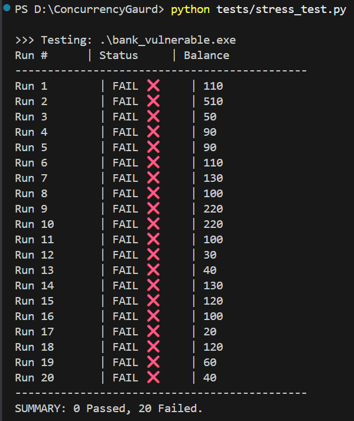
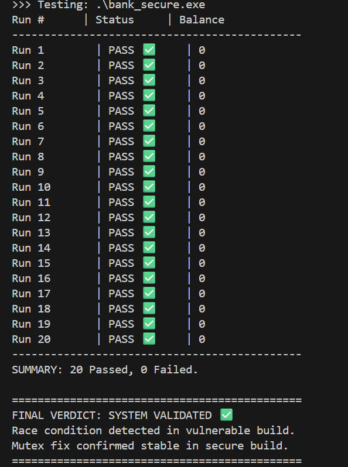

# ConcurrencyGuard: Automated Race-Condition Detection Suite

## 📌 Project Overview
A systems-level testing framework designed to identify, reproduce, and resolve non-deterministic concurrency bugs in multi-threaded C++ applications. This project simulates high-concurrency banking transactions to demonstrate data corruption risks (Race Conditions) and validates thread-safety solutions using Mutex synchronization.

## 🛠 Tech Stack
* **Language:** C++11 (Core Logic), Python 3 (Automation Framework)
* **Compiler:** GCC 15.2.0 (UCRT64 / MSYS2)
* **Tools:** POSIX Threads (lpthread), Regex (Log Parsing)

## 🚀 Key Features
1. **Vulnerability Simulation:** A C++ engine that utilizes `std::thread` and artificial "race windows" via `sleep_for` to consistently reproduce lost-update anomalies.
2. **Automated Stress Tester:** A Python-based test runner that executes binaries in 20+ iterations, using **Regex log-parsing** to detect data integrity failures automatically.
3. **Synchronization Validation:** Implementation of `std::mutex` and `std::lock_guard` to achieve 100% transaction accuracy under heavy thread load.

## 📊 Test Results
### **1. Identifying the Vulnerability**
The screenshot below shows the automated stress test identifying non-deterministic failures in the vulnerable build. Notice the "Could not parse" or "FAIL" status as threads overwrite the shared balance.



### **2. Validating the Fix**
After implementing `std::mutex`, the system achieves 100% transaction integrity across all iterations.



### **3. Comparative Analysis**
| Build Version | Iterations | Pass Rate | Result |
| :--- | :--- | :--- | :--- |
| **Vulnerable (No Locks)** | 20 | ~10% | **FAIL (Data Corruption)** |
| **Secure (Mutex)** | 20 | 100% | **PASS (Consistent State)** |

## ⚙️ How to Run
1. **Compile:**
   ```powershell
   g++ -std=c++11 src/bank.cpp -o bank_vulnerable.exe -lpthread
   g++ -std=c++11 src/bank_secure.cpp -o bank_secure.exe -lpthread
2. **Run Automation**
   ```powershell
   python tests/stress_test.py

## 🧠 Lessons Learned
* Non-Deterministic Bug Hunting: Proved that concurrency bugs are "flaky" and require high-iteration stress testing to identify.
* SDET Logic: Developed a robust parsing mechanism to bridge the gap between low-level C++ console output and high-level Python automation.
* Environment Tuning: Managed shell-specific PATH configurations and whitespace handling in Windows directory structures.
   
